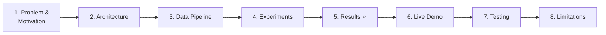

# 🎤 Tweet Classifier — Walkthrough Guide

A suggested structure and talking points for presenting your **Tweet Topic Classifier** project (CETM46 Assignment 2).

> [!TIP]
> Aim for a natural flow: **Problem → Data → Pipeline → Experiments → Results → App Demo → Reflection**. Each section below has talking points you can adapt.

---

## 1. Opening — Problem & Motivation (1–2 min)

**What to say:**

- *"The goal of this project is to automatically classify tweets into one of six topic categories."*
- Explain **who** the product is for: social-media managers, comms teams — people who need to quickly understand what topics are trending without reading every tweet.
- List the 6 classes: `arts_&_culture`, `business_&_entrepreneurs`, `daily_life`, `pop_culture`, `science_&_technology`, `sports_&_gaming`.
- Mention the two interaction modes: **single-message classification** (paste one tweet) and **batch CSV classification** (upload a file, get predictions back).

**Key point to emphasise:**
> This isn't just a notebook — it's a **product prototype** with a clean pipeline, a web UI, and reproducible experiments.

---

## 2. Project Architecture (2–3 min)

**What to say:**

- Walk through the directory structure and explain the **modular, config-driven design**:

```
tweet_classifier/
├── config.yaml          ← Single source of truth for all parameters
├── data/                ← Raw JSON + cached Parquet splits
├── src/
│   ├── data/            ← Loading & stratified splitting
│   ├── features/        ← Tweet-specific text cleaning
│   ├── models/          ← Factory pattern for experiment grid
│   ├── evaluation/      ← Metrics, CV, McNemar's test
│   └── app/             ← Streamlit end-user UI
├── models/              ← Persisted best pipeline (.joblib)
├── reports/             ← Leaderboard CSV, confusion matrices
├── notebooks/           ← Exploration & experimentation
└── tests/               ← Pytest smoke tests
```

**Key design decisions to highlight:**

| Decision | Why |
|----------|-----|
| All parameters in [config.yaml](file:///Users/mustaphi/Downloads/tweet_classifier/config.yaml) | One place to tune everything; reproducibility |
| LRU-cached config loading ([config.py](file:///Users/mustaphi/Downloads/tweet_classifier/src/config.py)) | Avoids repeated disk reads |
| Splits cached as Parquet files ([split.py](file:///Users/mustaphi/Downloads/tweet_classifier/src/data/split.py)) | Every experiment scores on the exact same held-out set |
| Module-level `_clean_step` in [registry.py](file:///Users/mustaphi/Downloads/tweet_classifier/src/models/registry.py) | Ensures sklearn pipelines are pickle-friendly with joblib |

---

## 3. Data Pipeline (2–3 min)

### 3a. Data Loading
- Raw data is a JSON file (`Data.json`) with ~6,400 tweets.
- [load.py](file:///Users/mustaphi/Downloads/tweet_classifier/src/data/load.py) validates 5 required columns, deduplicates by ID, drops blank text rows.
- Show the **class distribution** chart — highlight the severe imbalance:
  - Largest class: `pop_culture` at **39%**
  - Smallest class: `arts_&_culture` at only **2.2%** (≈6× imbalance)

### 3b. Splitting Strategy
- Two-stage stratified split: **70% train / 15% val / 15% test**
- Stratification preserves class proportions across all splits
- Splits are cached to Parquet — *"Once generated, every experiment uses the exact same data partitions."*

### 3c. Preprocessing
- Light-touch regex cleaning via [preprocess.py](file:///Users/mustaphi/Downloads/tweet_classifier/src/features/preprocess.py):
  - Lowercase, strip `{@...@}` entity markup, replace URLs → `"URL"`, replace @mentions → `"USER"`
  - **Hashtags kept** intentionally — they carry topical signal
  - No stemming/lemmatisation — *"I let the vectoriser handle token-level feature engineering"*
- Regexes pre-compiled at module import time for performance

---

## 4. Experimentation (3–4 min)

### 4a. Experiment Grid
- **Factory pattern** in [registry.py](file:///Users/mustaphi/Downloads/tweet_classifier/src/models/registry.py): each experiment is a declarative `ExperimentSpec` (representation + classifier)
- 3 text representations × 4 classifiers = 7 selected experiments:

| # | Experiment | Representation | Classifier |
|---|-----------|---------------|-----------|
| 1 | baseline_tfidf_logreg | TF-IDF (1,2)-grams | Logistic Regression |
| 2 | bow_logreg | Bag-of-Words unigrams | Logistic Regression |
| 3 | tfidf_svm | TF-IDF (1,2)-grams | LinearSVC |
| 4 | tfidf_nb | TF-IDF (1,2)-grams | Multinomial NB |
| 5 | tfidf_rf | TF-IDF (1,2)-grams | Random Forest |
| 6 | char_tfidf_logreg | Char-level TF-IDF (3,5)-grams | Logistic Regression |
| 7 | **char_tfidf_svm** | Char-level TF-IDF (3,5)-grams | **LinearSVC** |

**Key point:**
> *"All classifiers that support it use `class_weight='balanced'` to handle the imbalance. I also use **macro F1** as the primary metric — it treats every class equally regardless of size."*

### 4b. Training Pipeline
- [train.py](file:///Users/mustaphi/Downloads/tweet_classifier/src/models/train.py) automates the full loop:
  1. Fit each experiment on train set
  2. Score on validation set
  3. Save confusion matrix figures
  4. Rank by macro F1 → build leaderboard
  5. **Refit the winner on train + val combined**
  6. Final evaluation on held-out test set
  7. Persist model (`.joblib`) + metadata (`.meta.json`)

---

## 5. Results (3–4 min) ⭐

> [!IMPORTANT]
> This is the most important section — spend time here. Show the numbers confidently.

### 5a. Validation Leaderboard

| Rank | Experiment | Accuracy | Macro F1 |
|------|-----------|----------|----------|
| 🥇 | **char_tfidf_svm** | 0.816 | **0.679** |
| 🥈 | char_tfidf_logreg | 0.799 | 0.670 |
| 🥉 | tfidf_svm | 0.799 | 0.636 |
| 4 | baseline_tfidf_logreg | 0.781 | 0.624 |
| 5 | bow_logreg | 0.778 | 0.601 |
| 6 | tfidf_nb | 0.749 | 0.422 |
| 7 | tfidf_rf | 0.704 | 0.419 |

**Talking point:** *"Character-level n-grams outperformed word-level features — this makes sense for tweets where spelling is inconsistent, hashtags are creative, and word boundaries are noisy."*

### 5b. Cross-Validation Confirmation

- 5-fold stratified CV confirmed the same ranking: `char_tfidf_svm` has the highest mean F1 of **0.653 ± 0.037**
- *"CV confirms this isn't a lucky split — the model is consistently best."*

### 5c. Statistical Significance — McNemar's Test

- Compared the top 2 models on the test set: **char_tfidf_svm vs char_tfidf_logreg**
- McNemar's chi-squared: **statistic = 6.63, p = 0.010**
- 48 cases where only SVM was right vs 25 where only LogReg was right
- *"The difference is statistically significant at p < 0.05 — the SVM advantage is real, not noise."*

### 5d. Final Test Set Performance (Winner)

| Metric | Score |
|--------|-------|
| Accuracy | **0.821** |
| Macro F1 | **0.670** |
| Weighted F1 | **0.817** |
| Best per-class F1 | `sports_&_gaming` → 0.916 |
| Worst per-class F1 | `arts_&_culture` → 0.323 (only 22 test samples) |

**Talking point:** *"The model achieves 82% accuracy overall, but the macro F1 of 0.67 reflects the reality that minority classes like arts & culture are much harder — that's an honest metric for imbalanced data."*

---

## 6. App Demo (2–3 min)

- Open the Streamlit app and walk through it live:

### What to show:
1. **Sidebar** — model metadata (experiment name, test accuracy, F1)
2. **Single Message tab** — type/paste a tweet, click classify, show the predicted label + confidence score
3. **Batch CSV tab** — upload a small CSV, download the results with predictions attached

### Suggested demo tweets to paste:

| Tweet | Expected Class |
|-------|---------------|
| *"Just watched the new Marvel movie, absolutely loved it!"* | pop_culture |
| *"Bitcoin just hit an all-time high, incredible rally"* | business_&_entrepreneurs |
| *"Amazing goal by Messi in the Champions League final"* | sports_&_gaming |
| *"New study shows potential breakthrough in CRISPR gene therapy"* | science_&_technology |

> [!TIP]
> Prepare these tweets in advance so you're not improvising during the demo.

---

## 7. Testing & Reproducibility (1–2 min)

- **6 pytest smoke tests** in [test_pipeline.py](file:///Users/mustaphi/Downloads/tweet_classifier/tests/test_pipeline.py) covering:
  - Data schema validation
  - Label distribution integrity
  - Preprocessing correctness (entity markup, URLs, mentions)
  - Split stratification and disjointness
  - Pipeline beating the majority baseline
- **Reproducibility** — seeded randomness (`random_state: 42`), cached Parquet splits, serialised model with config hash

**Talking point:** *"Every result in this project can be regenerated from scratch with a single command."*

---

## 8. Limitations & Future Work (1–2 min)

Be honest — it shows maturity:

- **Class imbalance:** `arts_&_culture` has only 2.2% of data → F1 of just 0.32
- **Temporal drift:** Trained on 2019–2021 tweets; performance on newer data will degrade
- **Platform specificity:** Preprocessing handles tweet markup (`{@...@}`); inputs from other platforms may need their own cleaner
- **No deep learning:** Stayed with sklearn for interpretability and speed; a fine-tuned BERT/DistilBERT could improve minority-class recall

---

## 9. Component Deep-Dive: What to Show & What to Say 🔍

> [!NOTE]
> This section gives you a **file-by-file script**. When presenting each component, open the file on screen, point at the highlighted lines, and use the talking points below.

---

### 9.1 Configuration — [config.yaml](file:///Users/mustaphi/Downloads/tweet_classifier/config.yaml) + [config.py](file:///Users/mustaphi/Downloads/tweet_classifier/src/config.py)

**Open:** `config.yaml` first, then `src/config.py`

**What to point at in `config.yaml`:**
- `random_state: 42` (line 3) — *"This single seed controls all randomness in the project — the splits, the model training, cross-validation. It's how I ensure reproducibility."*
- The `paths:` block (lines 5–9) — *"Every file path the pipeline uses is defined here, not hardcoded. If I move the data folder, I change one line."*
- `split:` block (lines 12–15) — *"15% test, 15% validation, with stratification turned on to preserve class proportions."*
- `preprocessing:` block (lines 17–23) — *"Each cleaning step is a boolean flag. Notice `replace_hashtags: false` — I intentionally keep hashtags because they carry strong topical signal. For example, `#CryptoNews` is a direct hint that this is a business tweet."*
- `class_names:` (lines 30–36) — *"The six topic classes are mapped to integer labels 0 through 5. This mapping is verified against the raw data."*

**What to point at in `config.py`:**
- `@lru_cache(maxsize=1)` on [load_config](file:///Users/mustaphi/Downloads/tweet_classifier/src/config.py#L14-L19) (line 14) — *"I use Python's `lru_cache` decorator so the YAML file is read from disk exactly once, no matter how many modules import it. Every part of the pipeline — data loading, preprocessing, training, the Streamlit app — all share the same cached config object."*
- [resolve_path](file:///Users/mustaphi/Downloads/tweet_classifier/src/config.py#L22-L24) (line 22) — *"This helper resolves relative paths from the config against the project root, so the code works regardless of which directory you run it from."*

---

### 9.2 Data Loading — [load.py](file:///Users/mustaphi/Downloads/tweet_classifier/src/data/load.py)

**Open:** `src/data/load.py`

**What to point at:**
- `REQUIRED_COLUMNS` (line 12) — *"Before doing anything, I validate that the JSON file has the five columns I expect: `text`, `date`, `label`, `id`, and `label_name`. If any are missing, it raises a clear `ValueError` telling you what's wrong."*
- The [load_raw](file:///Users/mustaphi/Downloads/tweet_classifier/src/data/load.py#L15-L49) function (lines 15–49):
  - Lines 20–24 (FileNotFoundError) — *"Defensive coding: if the data file isn't where expected, the user gets a helpful message, not a cryptic stack trace."*
  - Lines 36–39 (type normalisation) — *"I explicitly cast each column to the right dtype — `text` to string, `label` to int, `date` to datetime. This prevents subtle bugs downstream where Pandas might infer the wrong type."*
  - Lines 43–47 (dedup + blank removal) — *"I drop duplicate tweet IDs and empty text rows. The print statement tells you how many were removed, so you have an audit trail."*
- [label_distribution](file:///Users/mustaphi/Downloads/tweet_classifier/src/data/load.py#L52-L56) (lines 52–56) — *"A quick utility that returns a count and percentage for each class. I use this in the notebook to generate the class distribution chart, which shows the severe 39% vs 2.2% imbalance."*

---

### 9.3 Data Splitting — [split.py](file:///Users/mustaphi/Downloads/tweet_classifier/src/data/split.py)

**Open:** `src/data/split.py`

**What to point at:**
- [make_splits](file:///Users/mustaphi/Downloads/tweet_classifier/src/data/split.py#L14-L57) (lines 14–57):
  - Lines 22–23 (cache check) — *"Before re-splitting, I check if Parquet files already exist. If they do, I just read them back. This is critical: it guarantees that every experiment — whether I run it today or next week — is evaluated on exactly the same data partitions."*
  - Lines 33–38 (first split) — *"I split off the test set first: 15% of the full dataset, stratified by label."*
  - Lines 41–48 (second split) — *"Then I split the remaining 85% into train and validation. Notice line 41: I recalculate the validation fraction relative to the remaining data — `val_size / (1.0 - test_size)` — so the final proportions come out correctly at 70/15/15."*
  - Lines 54–55 (Parquet persistence) — *"The splits are saved as Parquet files, which are fast to read and preserve dtypes. This is the caching mechanism."*

**Key talking point:**
> *"A common mistake in ML is re-splitting data between experiments and accidentally evaluating on different test sets. By caching splits to disk, I eliminate that risk entirely."*

---

### 9.4 Text Preprocessing — [preprocess.py](file:///Users/mustaphi/Downloads/tweet_classifier/src/features/preprocess.py)

**Open:** `src/features/preprocess.py`

**What to point at:**
- Lines 10–14 (compiled regexes) — *"I pre-compile all five regex patterns at module import time. This means they're compiled once when Python loads the module, not every time we clean a tweet. With thousands of tweets to process, this makes a noticeable speed difference."*
  - `_URL_RE` — matches `http://` and `www.` URLs
  - `_MENTION_RE` — matches `@username` patterns
  - `_ENTITY_MARKUP_RE` — matches the dataset's `{@ ... @}` entity wrapping
  - `_MULTISPACE_RE` — collapses multiple spaces
- [PreprocessingConfig](file:///Users/mustaphi/Downloads/tweet_classifier/src/features/preprocess.py#L17-L30) (lines 17–30) — *"This is a frozen dataclass with six boolean flags, one per cleaning step. `frozen=True` means it's immutable after creation — you can't accidentally change a config mid-run. The `from_dict()` class method creates it from the YAML config."*
- [clean_text](file:///Users/mustaphi/Downloads/tweet_classifier/src/features/preprocess.py#L33-L57) (lines 33–57) — *"Each cleaning step is guarded by its config flag. Walk through the order:"*
  1. Strip `{@...@}` entity markup but keep the text inside (line 39)
  2. Replace URLs with the token `URL` (line 42)
  3. Replace @mentions with the token `USER` (line 45)
  4. Hashtags are **not** stripped by default (line 48–49) — *"I keep `#CryptoNews` as-is because the hashtag itself is a strong topic signal. The vectoriser will handle it as a token."*
  5. Lowercase everything (line 51)
  6. Collapse whitespace (line 54–55)

**Key talking point:**
> *"I deliberately kept preprocessing light-touch — no stemming, no lemmatisation. My reasoning is: tweets are short, noisy, and full of slang. Aggressive stemming can destroy useful signal. I let the vectoriser handle feature engineering at the token level instead."*

---

### 9.5 Model Registry — [registry.py](file:///Users/mustaphi/Downloads/tweet_classifier/src/models/registry.py)

**Open:** `src/models/registry.py`

**What to point at:**
- [_clean_step](file:///Users/mustaphi/Downloads/tweet_classifier/src/models/registry.py#L21-L24) (lines 21–24) — *"This is a module-level function that wraps the preprocessing. It has to be at module scope — not a lambda or nested function — because `joblib` needs to pickle the trained pipeline. If I used a lambda, saving the model to disk would fail."*
- [_make_vectoriser](file:///Users/mustaphi/Downloads/tweet_classifier/src/models/registry.py#L29-L54) (lines 29–54) — *"A factory function that creates three different text representations:"*
  - `"bow"` (line 31–37) — *"Basic Bag-of-Words: unigrams only, `min_df=2` to drop very rare words, `max_df=0.95` to drop words that appear in 95%+ of tweets — those have no discriminative power."*
  - `"tfidf"` (line 39–45) — *"TF-IDF with (1,2)-grams, meaning unigrams and bigrams. `sublinear_tf=True` applies log-scaling to term frequencies, which prevents very common words from dominating."*
  - `"char_tfidf"` (line 46–53) — *"Character-level TF-IDF with n-grams from 3 to 5 characters. The `analyzer='char_wb'` setting means it respects word boundaries. This is the representation that ended up winning — character n-grams capture sub-word patterns like hashtags, abbreviations, and misspellings that word-level features miss."*
- [_make_classifier](file:///Users/mustaphi/Downloads/tweet_classifier/src/models/registry.py#L59-L86) (lines 59–86) — *"Factory for four classifiers. The key design choice: every classifier that supports it uses `class_weight='balanced'`."*
  - `"logreg"` (line 61–68) — *"`max_iter=2000` gives the solver enough iterations to converge on this dataset. `class_weight='balanced'` automatically upweights minority classes."*
  - `"svm"` (line 69–74) — *"LinearSVC — a linear support vector machine. Also uses balanced class weights."*
  - `"nb"` (line 75–77) — *"Multinomial Naive Bayes with `alpha=0.3` for Laplace smoothing. NB doesn't support `class_weight`, which is one reason it performed worst."*
  - `"rf"` (line 78–85) — *"Random Forest with 400 trees and `n_jobs=-1` for parallel training."*
- [ExperimentSpec](file:///Users/mustaphi/Downloads/tweet_classifier/src/models/registry.py#L92-L104) (lines 92–104) — *"Each experiment is a frozen dataclass with a name, a representation type, and a classifier type. The `__post_init__` validates that you can't accidentally create an experiment with an unknown representation or classifier."*
- [build_pipeline](file:///Users/mustaphi/Downloads/tweet_classifier/src/models/registry.py#L111-L120) (lines 111–120) — *"This is the heart of the factory pattern. It builds a three-step sklearn Pipeline: clean → vectorise → classify. The spec tells it which vectoriser and classifier to use. This design means I can add a new representation or classifier by editing one factory function, and all experiments benefit."*
- [DEFAULT_EXPERIMENTS](file:///Users/mustaphi/Downloads/tweet_classifier/src/models/registry.py#L124-L132) (lines 124–132) — *"The seven experiments I chose to run. It's not every combination — I picked the ones that test meaningful hypotheses: Does character-level help? Does SVM beat logistic regression? How does Naive Bayes compare?"*

**Key talking point:**
> *"The factory pattern means my training script doesn't know or care about specific models. It just iterates over `DEFAULT_EXPERIMENTS`, calls `build_pipeline`, and the registry handles the rest. Adding a new experiment is one line of code."*

---

### 9.6 Training & Model Selection — [train.py](file:///Users/mustaphi/Downloads/tweet_classifier/src/models/train.py)

**Open:** `src/models/train.py`

**What to point at:**
- [_fit_and_score](file:///Users/mustaphi/Downloads/tweet_classifier/src/models/train.py#L19-L31) (lines 19–31) — *"Helper that fits one pipeline on training data and scores it on validation. It returns both the fitted pipeline and a dictionary of metrics."*
- [run_all_experiments](file:///Users/mustaphi/Downloads/tweet_classifier/src/models/train.py#L34-L120) — walk through the **five phases**:
  1. **Setup** (lines 36–46) — *"Load the cached splits, create output directories."*
  2. **Training loop** (lines 51–66) — *"For each experiment: build pipeline → fit on train → predict on val → compute metrics → save confusion matrix. This generates one PNG per experiment."*
  3. **Leaderboard** (lines 68–72) — *"Sort all experiments by macro F1 descending. The top row is the winner."*
  4. **Refit the winner** (lines 74–89) — *"This is a critical step that's easy to miss. The winner was selected based on validation performance, but we want to give it as much data as possible for the final model. So I refit it on train + validation combined, then evaluate on the held-out test set. This is standard ML practice."*
  5. **Persist** (lines 99–119) — *"I save three artefacts: the leaderboard CSV, the trained pipeline as a `.joblib` file, and a metadata JSON with the timestamp, experiment details, class names, and test metrics. The metadata JSON is what the Streamlit app reads to display model info in the sidebar."*

**Key talking point:**
> *"The entire experiment pipeline — from raw data to a persisted, production-ready model — runs with a single command: `python -m src.models.train`. No manual steps, no notebooks to re-run in order."*

---

### 9.7 Inference — [predict.py](file:///Users/mustaphi/Downloads/tweet_classifier/src/models/predict.py)

**Open:** `src/models/predict.py`

**What to point at:**
- [load_model](file:///Users/mustaphi/Downloads/tweet_classifier/src/models/predict.py#L15-L29) (lines 15–29) — *"Uses `@lru_cache(maxsize=1)` so the model is loaded from disk exactly once, even if the Streamlit app calls it multiple times. It loads both the pipeline and the metadata JSON."*
- [predict](file:///Users/mustaphi/Downloads/tweet_classifier/src/models/predict.py#L32-L65) (lines 32–65):
  - Lines 39–42 (`predict_proba`) — *"If the model supports probabilities (like Logistic Regression), I use those as confidence scores."*
  - Lines 43–52 (`decision_function` fallback) — *"But LinearSVC — which is our winning model — doesn't have `predict_proba`. Instead, it has `decision_function`, which returns margin scores. I fall back to these margins as a confidence-like measure. For multi-class, I pick the margin of the predicted class using `np.take_along_axis`."*
  - Lines 57–65 (result construction) — *"Each prediction is returned as a dictionary with the text, label ID, label name, and the confidence or decision score. This clean structure is what the Streamlit app consumes."*

**Key talking point:**
> *"The `predict_proba` vs `decision_function` fallback is a practical engineering decision. I wanted the product to work regardless of which model won the experiment grid. If a different model had won — say Logistic Regression — the app would automatically show probability-based confidence instead of margins."*

---

### 9.8 Evaluation Metrics — [metrics.py](file:///Users/mustaphi/Downloads/tweet_classifier/src/evaluation/metrics.py)

**Open:** `src/evaluation/metrics.py`

**What to point at:**
- `matplotlib.use("Agg")` (line 8) — *"I set the matplotlib backend to 'Agg' for headless rendering. This means confusion matrix figures can be generated on a server or in CI without a display."*
- [per_class_counts](file:///Users/mustaphi/Downloads/tweet_classifier/src/evaluation/metrics.py#L20-L31) (lines 20–31) — *"Computes TP, FP, FN, TN for each class from the confusion matrix in a one-vs-rest fashion. This is used in the detailed per-class metrics."*
- [score_predictions](file:///Users/mustaphi/Downloads/tweet_classifier/src/evaluation/metrics.py#L34-L63) (lines 34–63) — *"Computes three headline metrics: accuracy, macro F1, and weighted F1. Then for each class, it computes precision, recall, F1, and support. Everything is returned as a single dictionary — this is the scoring function used by both the training loop and the comparison module."*
- [save_confusion_matrix](file:///Users/mustaphi/Downloads/tweet_classifier/src/evaluation/metrics.py#L66-L101) (lines 66–101) — *"Renders a seaborn heatmap and saves it to PNG. It supports both raw counts and normalised (row-wise) views. I save one per experiment on validation, plus one for the winner on the test set."*

---

### 9.9 Cross-Validation & Statistical Testing — [compare.py](file:///Users/mustaphi/Downloads/tweet_classifier/src/evaluation/compare.py)

**Open:** `src/evaluation/compare.py`

**What to point at:**
- [cross_validate_experiments](file:///Users/mustaphi/Downloads/tweet_classifier/src/evaluation/compare.py#L18-L48) (lines 18–48) — *"Runs 5-fold stratified cross-validation on every experiment. The key is `n_jobs=-1` — it parallelises across all CPU cores, so the whole grid finishes faster. The output is sorted by mean F1 score."*

  *"Why do CV on top of the validation set? The validation set is a single split — it could be lucky or unlucky. CV gives me a mean and standard deviation across 5 different train/test folds, which is much more robust."*

- [mcnemar_test](file:///Users/mustaphi/Downloads/tweet_classifier/src/evaluation/compare.py#L51-L86) (lines 51–86) — *"McNemar's test is a paired statistical test. It doesn't just compare two accuracy numbers — it looks at the specific samples where the models disagree."*
  - Lines 58–61 (contingency table) — *"It counts four categories: both right, both wrong, only A right, only B right. The test focuses on the off-diagonal cells — the disagreements."*
  - Lines 64–79 (dual method) — *"For small disagreement counts (< 25), I use the exact binomial test. For larger counts, I use chi-squared with continuity correction. This dual approach is statistically proper."*

- [main](file:///Users/mustaphi/Downloads/tweet_classifier/src/evaluation/compare.py#L89-L131) (lines 89–131) — *"The orchestration function: run CV → rank experiments → take the top 2 → refit both on train+val → compare them on test set with McNemar's → save the result to JSON."*

**Key talking point:**
> *"The McNemar test answers a question that accuracy alone cannot: is the difference between these two models real, or could it be random chance? With a p-value of 0.01, I'm confident the SVM genuinely outperforms Logistic Regression on this data."*

---

### 9.10 Streamlit App — [streamlit_app.py](file:///Users/mustaphi/Downloads/tweet_classifier/src/app/streamlit_app.py)

**Open:** `src/app/streamlit_app.py`

**What to point at:**
- Lines 13–15 (path fix) — *"When Streamlit launches this file directly, the project root may not be on Python's import path. This block adds it, so `from src.models.predict import ...` works reliably."*
- [_bootstrap](file:///Users/mustaphi/Downloads/tweet_classifier/src/app/streamlit_app.py#L34-L37) (lines 34–37) — *"`@st.cache_resource` ensures the model is loaded once and shared across all users and reruns. Without this, Streamlit would reload the 4 MB joblib file on every button click."*
- Lines 40–44 (error handling) — *"If the model hasn't been trained yet, the app shows a friendly error instead of crashing."*
- Lines 47–60 (sidebar) — *"The sidebar shows model metadata pulled from `best_pipeline.meta.json`: which experiment won, what representation and classifier it uses, and the held-out test metrics. This gives the user transparency about what's behind the predictions."*
- Lines 66–85 (single message tab) — *"Simple interaction: text area → classify button → display predicted label. Notice lines 80–85: if the model has `predict_proba`, I show a progress bar as a confidence indicator. If it's LinearSVC with `decision_function`, I show the margin as a number instead."*
- Lines 89–118 (batch CSV tab) — *"Upload a CSV → validate it has a `text` column → batch predict → show a preview of the first 20 rows → offer a download button for the full results. This is the 'power user' feature for social-media managers processing hundreds of posts at once."*

**Key talking point:**
> *"The app is designed for people with zero data-science knowledge. They don't need to know what TF-IDF or LinearSVC means. They paste text, click a button, and get a topic label. That's the 'product' aspect of this project."*

---

### 9.11 Tests — [test_pipeline.py](file:///Users/mustaphi/Downloads/tweet_classifier/tests/test_pipeline.py)

**Open:** `tests/test_pipeline.py`

**What to point at:**
- [test_load_raw_returns_expected_schema](file:///Users/mustaphi/Downloads/tweet_classifier/tests/test_pipeline.py#L20-L25) (lines 20–25) — *"Verifies the data loader produces all five required columns and exactly six classes. This catches data format changes early."*
- [test_label_distribution_sums_to_100_percent](file:///Users/mustaphi/Downloads/tweet_classifier/tests/test_pipeline.py#L28-L30) (lines 28–30) — *"A sanity check: the percentage column from `label_distribution` should sum to 100%. If not, there's a bug in the calculation."*
- [test_clean_text_removes_entity_markup](file:///Users/mustaphi/Downloads/tweet_classifier/tests/test_pipeline.py#L33-L37) (lines 33–37) — *"Tests that `{@Clinton LumberKings@}` becomes `clinton lumberkings` — the markup is stripped but the content is preserved."*
- [test_clean_text_replaces_urls_and_mentions](file:///Users/mustaphi/Downloads/tweet_classifier/tests/test_pipeline.py#L40-L46) (lines 40–46) — *"Tests that URLs become `url` and @mentions become `user`."*
- [test_splits_are_stratified_and_disjoint](file:///Users/mustaphi/Downloads/tweet_classifier/tests/test_pipeline.py#L49-L57) (lines 49–57) — *"Verifies three things: no tweet ID appears in more than one split, and all six classes are present in every split. This confirms stratification is working correctly."*
- [test_tiny_pipeline_beats_majority_baseline](file:///Users/mustaphi/Downloads/tweet_classifier/tests/test_pipeline.py#L60-L70) (lines 60–70) — *"The most important test: it trains a TF-IDF + Logistic Regression pipeline and checks that its accuracy exceeds the majority-class baseline. If even a simple pipeline can't beat 'always predict pop_culture', something is fundamentally broken."*

**Key talking point:**
> *"These are smoke tests, not exhaustive. They run in seconds and catch the most likely failures: data format changes, preprocessing regressions, split corruption, and model sanity. They're the safety net that lets me refactor with confidence."*

---

## 🗺️ Suggested Flow Summary



| Section | Time | Key Artefact to Show |
|---------|------|---------------------|
| Problem & Motivation | 1–2 min | README intro |
| Architecture | 2–3 min | Directory tree |
| Data Pipeline | 2–3 min | `class_distribution.png` |
| Experiments | 3–4 min | `registry.py` experiment grid |
| Results | 3–4 min | `results.csv`, confusion matrices, `mcnemar.json` |
| Live Demo | 2–3 min | Streamlit app |
| Testing | 1–2 min | `test_pipeline.py` |
| Limitations | 1–2 min | Honest reflection |
| **Total** | **~15–20 min** | |

---

> [!NOTE]
> **Pro tips for delivery:**
> - Open the relevant source file on screen when explaining each component — use Section 9 above for exact line numbers and talking points.
> - When showing results, start with the leaderboard table, then zoom into confusion matrices for the winner.
> - During the demo, classify a tweet that's ambiguous (e.g., an esports tweet) to show how the model handles edge cases.
> - End on limitations — it demonstrates critical thinking and awareness of real-world deployment challenges.
